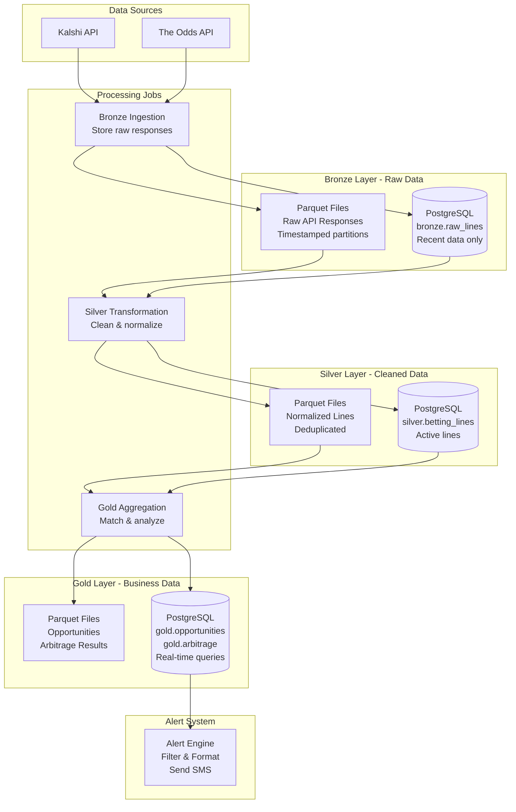

# Bet Opportunity Finder App - Implementation Plan

## Overview
An application that identifies opportunistic betting opportunities by comparing Kalshi lines against other sportsbooks, and detects arbitrage opportunities for guaranteed profit. The app sends SMS alerts to users about these opportunities.

## Core Features

### 1. **Opportunistic Bet Detection**
   - Compare Kalshi betting lines against multiple sportsbooks (DraftKings, FanDuel, BetMGM, etc.)
   - Identify lines where Kalshi offers better odds/value
   - Calculate expected value (EV) for each opportunity
   - Filter by minimum EV threshold

### 2. **Arbitrage Detection**
   - Find arbitrage opportunities across Kalshi and other sportsbooks
   - Calculate guaranteed profit percentage
   - Determine optimal bet sizing for each side
   - Verify both sides are available simultaneously

### 3. **SMS Alert System**
   - Send real-time alerts for opportunistic bets
   - Send alerts for arbitrage opportunities
   - Allow users to configure alert preferences (min EV, min arbitrage %, sports, etc.)
   - Rate limiting to prevent spam

## Architecture

### Medallion Architecture

This application uses a **medallion architecture** with three data layers (Bronze/Silver/Gold) to organize data from raw API responses through cleaned, normalized data to business-ready opportunities and arbitrage calculations.

### System Components



### Medallion Layer Details

#### Bronze Layer - Raw Data Landing

**Purpose**: Store raw, unprocessed API responses exactly as received

**Storage**:
- **PostgreSQL**: Recent data only (configurable retention, default 7 days)
  - Schema: `bronze`
  - Table: `raw_lines`
  - Columns: `id`, `source`, `timestamp`, `raw_response` (JSONB), `api_endpoint`, `response_status`
- **Parquet files**: Partitioned by date/hour
  - Path: `data/bronze/raw_lines/{source}/{year}/{month}/{day}/{hour}/`
  - Format: One file per API call response
  - Schema: Flexible JSON structure

**Features**:
- No transformation, just timestamp and source tagging
- Full data lineage tracking
- Long-term archive in Parquet files

#### Silver Layer - Cleaned & Normalized

**Purpose**: Cleaned, validated, and normalized betting lines ready for analysis

**Storage**:
- **PostgreSQL**: Active lines for real-time queries
  - Schema: `silver`
  - Table: `betting_lines`
  - Columns: `id`, `timestamp`, `source`, `event_name`, `sport`, `market_type`, `outcome_name`, `outcome_odds`, `outcome_odds_decimal`, `line_value`, `implied_probability`, `is_active`, `event_start_time`, `bronze_id`
- **Parquet files**: Partitioned by date
  - Path: `data/silver/betting_lines/{year}/{month}/{day}/`
  - Format: One row per outcome
  - Schema: Normalized structure

**Transformation Logic**:
1. Extract betting lines from raw JSON
2. Normalize odds formats (convert to American + decimal)
3. Calculate implied probabilities
4. Standardize event names and sport types
5. Deduplicate (same source + event + outcome + timestamp)
6. Validate data quality (odds in valid range, etc.)

#### Gold Layer - Business Intelligence

**Purpose**: Matched markets, opportunities, and arbitrage calculations

**Storage**:
- **PostgreSQL**: Real-time opportunities for alerting
  - Schema: `gold`
  - Tables: `matched_markets`, `opportunities`, `arbitrage_opportunities`
- **Parquet files**: Aggregated opportunities
  - Path: `data/gold/opportunities/{year}/{month}/{day}/`
  - Format: One row per opportunity

**Gold Tables**:
- `matched_markets`: Markets matched across different sources with confidence scores
- `opportunities`: Opportunistic bets (better value on Kalshi) with expected value
- `arbitrage_opportunities`: Arbitrage opportunities with profit percentage and optimal bet sizing

### Data Flow

1. **Bronze Ingestion**: Collectors fetch data from APIs → Store raw responses in PostgreSQL and Parquet
2. **Silver Transformation**: Read from bronze → Clean and normalize → Store betting lines in PostgreSQL and Parquet
3. **Gold Aggregation**: Read from silver → Match markets across sources → Calculate opportunities and arbitrage → Store in PostgreSQL and Parquet
4. **Alert System**: Query gold layer → Filter by user preferences → Send SMS alerts

## Technology Stack Recommendations

### Backend
- **Language**: Python (excellent for data processing, API integrations)
- **Framework**: FastAPI or Flask (REST API)
- **Database**: PostgreSQL (structured betting data with bronze/silver/gold schemas) + Redis (caching/rate limiting)
- **Data Storage**: Parquet files (partitioned by date) for historical data
- **Task Queue**: Celery with Redis/RabbitMQ (background jobs)
- **Scheduling**: APScheduler or Celery Beat (periodic odds fetching)

### Data Collection
- **Kalshi API**: Official API if available, or web scraping
- **Sportsbook APIs**: 
  - The Odds API (aggregator)
  - Individual sportsbook APIs (DraftKings, FanDuel, etc.)
  - Web scraping as fallback (with proper rate limiting)

### SMS Service
- **Twilio** (recommended - reliable, good API)
- **AWS SNS** (alternative)
- **Vonage/Nexmo** (alternative)

### Data Processing
- **Parquet**: PyArrow for Parquet file operations
- **Data Lake**: Local filesystem (dev) or S3/MinIO (prod)
- **Delta Lake**: Optional, for ACID transactions and time travel

### Deployment
- **Containerization**: Docker
- **Orchestration**: Docker Compose (dev) or Kubernetes (prod)
- **Cloud**: AWS, GCP, or DigitalOcean
- **Monitoring**: Sentry (errors), Prometheus + Grafana (metrics)

## Data Models

### Betting Market
```python
{
    "id": "uuid",
    "event_id": "string",
    "event_name": "string",
    "sport": "string",
    "market_type": "string",  # moneyline, spread, total, etc.
    "outcomes": [
        {
            "name": "string",
            "odds": float,  # American odds format
            "implied_probability": float
        }
    ],
    "source": "kalshi" | "draftkings" | "fanduel" | ...,
    "timestamp": "datetime",
    "is_active": boolean
}
```

### Opportunity
```python
{
    "id": "uuid",
    "market_id": "string",
    "type": "opportunistic" | "arbitrage",
    "kalshi_side": {
        "outcome": "string",
        "odds": float,
        "implied_prob": float
    },
    "other_side": {
        "source": "string",
        "outcome": "string",
        "odds": float,
        "implied_prob": float
    },
    "expected_value": float,  # percentage
    "arbitrage_profit": float | null,  # percentage if arbitrage
    "optimal_bet_sizing": {
        "kalshi_amount": float,
        "other_amount": float,
        "total_investment": float,
        "guaranteed_profit": float
    } | null,
    "detected_at": "datetime",
    "expires_at": "datetime"
}
```

### User
```python
{
    "id": "uuid",
    "phone_number": "string",
    "preferences": {
        "min_ev_threshold": float,  # minimum expected value %
        "min_arbitrage_threshold": float,  # minimum arbitrage profit %
        "sports": ["string"],  # sports to monitor
        "market_types": ["string"],  # types of bets
        "alert_frequency": "immediate" | "hourly_digest" | "daily_digest",
        "max_alerts_per_day": int
    },
    "created_at": "datetime"
}
```

## Implementation Phases

### Phase 1: Foundation (Week 1-2) ✅ COMPLETED
1. **Project Setup** ✅
   - Initialize Python project with virtual environment
   - Set up project structure (src/data/ with bronze/silver/gold)
   - Configure database (PostgreSQL with bronze/silver/gold schemas)
   - Set up Docker containers

2. **Medallion Architecture Implementation** ✅
   - **Bronze Layer**: Raw data ingestion
     - Create base collector class
     - Implement Kalshi API collector
     - Implement The Odds API collector
     - Store raw responses in PostgreSQL and Parquet files
   - **Silver Layer**: Data transformation
     - Create transformers for each data source
     - Implement data validators
     - Normalize odds formats and calculate probabilities
     - Store cleaned lines in PostgreSQL and Parquet files
   - **Gold Layer**: Business intelligence
     - Implement market matching logic
     - Create opportunity and arbitrage analyzers
     - Store results in PostgreSQL and Parquet files

3. **Orchestration** ✅
   - Create bronze ingestion job
   - Create silver transformation job
   - Create gold aggregation job
   - Implement pipeline scheduler

### Phase 2: Core Logic (Week 2-3)
1. **Opportunity Detection**
   - Implement odds comparison algorithm
   - Calculate expected value
   - Match markets across different sources (event matching)
   - Handle different odds formats (American, Decimal, Fractional)

2. **Arbitrage Detection**
   - Implement arbitrage calculation algorithm
   - Calculate optimal bet sizing (Kelly Criterion or simple split)
   - Verify both sides are simultaneously available
   - Handle edge cases (different market types, etc.)

3. **Market Matching**
   - Event name normalization/fuzzy matching
   - Time-based matching (same event, similar start times)
   - Handle different market naming conventions

### Phase 3: Alert System (Week 3-4)
1. **SMS Integration**
   - Set up Twilio account and integration
   - Create SMS formatting templates
   - Implement rate limiting per user
   - Add delivery status tracking

2. **User Management**
   - User registration (phone number)
   - Preference management API
   - User authentication (optional, for web interface)

3. **Alert Filtering**
   - Apply user preferences to filter opportunities
   - Implement alert frequency controls
   - Create alert deduplication (don't send same alert twice)

### Phase 4: Automation & Monitoring (Week 4-5)
1. **Scheduled Jobs**
   - Set up periodic odds fetching (every 1-5 minutes)
   - Implement opportunity scanning job
   - Create alert dispatch job
   - Add job monitoring and error handling

2. **Data Quality**
   - Implement data validation
   - Add stale data detection
   - Create data cleanup jobs

3. **Monitoring & Logging**
   - Set up error tracking (Sentry)
   - Add application metrics
   - Create admin dashboard (optional)

### Phase 5: Enhancement (Week 5+)
1. **Web Interface** (Optional)
   - User dashboard to view opportunities
   - Preference management UI
   - Historical opportunity tracking

2. **Additional Features**
   - Support for more sportsbooks
   - Historical data analysis
   - Performance tracking
   - Email alerts (alternative to SMS)

## Key Algorithms

### Expected Value Calculation
```
EV = (Probability × Payout) - (1 - Probability) × Stake
EV% = (EV / Stake) × 100
```

### Arbitrage Detection
```
For two-way market:
- Side A: Odds A (implied prob P_A)
- Side B: Odds B (implied prob P_B)

Arbitrage exists if: P_A + P_B < 1

Optimal bet sizing:
- Total investment: I
- Bet on A: I × (P_A / (P_A + P_B))
- Bet on B: I × (P_B / (P_A + P_B))
- Guaranteed profit: I × (1 - (P_A + P_B))
```

### Market Matching
- Use fuzzy string matching (Levenshtein distance) for event names
- Match by sport, date, and team/participant names
- Handle abbreviations and different naming conventions

## Security & Compliance Considerations

1. **Rate Limiting**: Respect API rate limits for all data sources
2. **Legal Compliance**: Ensure compliance with gambling regulations
3. **Data Privacy**: Secure storage of user phone numbers
4. **API Keys**: Secure storage of API credentials (environment variables, secrets manager)
5. **Error Handling**: Graceful degradation if data sources are unavailable

## Testing Strategy

1. **Unit Tests**: Core calculation functions (EV, arbitrage)
2. **Integration Tests**: API clients, database operations
3. **End-to-End Tests**: Full flow from data fetch to alert sending
4. **Mock Data**: Use mock APIs for testing without hitting real services

## Cost Estimates

- **Twilio SMS**: ~$0.0075 per SMS (US numbers)
- **Database**: Free tier (PostgreSQL on Railway/Render) or ~$15/month
- **Hosting**: $5-20/month (VPS) or serverless (pay-per-use)
- **API Costs**: 
  - The Odds API: Free tier available, paid plans $10-50/month
  - Individual sportsbook APIs: May require partnerships

## Retention Policy

**Configuration** (in `.env`):

```
BRONZE_DB_RETENTION_DAYS=7  # Keep in PostgreSQL
BRONZE_FILE_RETENTION_DAYS=365  # Keep in Parquet files
SILVER_DB_RETENTION_DAYS=30  # Active lines in DB
SILVER_FILE_RETENTION_DAYS=forever  # Keep all history
GOLD_DB_RETENTION_DAYS=90  # Recent opportunities
GOLD_FILE_RETENTION_DAYS=forever  # Keep all history
```

## Benefits of Medallion Architecture

1. **Data Lineage**: Track data from raw to processed
2. **Reprocessing**: Easy to rebuild silver/gold from bronze
3. **Historical Analysis**: Query historical Parquet files
4. **Real-time Performance**: PostgreSQL for fast queries
5. **Cost Efficiency**: Archive old data to files, keep recent in DB
6. **Scalability**: Files can be moved to object storage (S3, etc.)

## Query Patterns

**Real-time** (from PostgreSQL):
- Get latest lines: Query `silver.betting_lines`
- Get active opportunities: Query `gold.opportunities`
- Get arbitrage: Query `gold.arbitrage_opportunities`

**Historical** (from Parquet):
- Analyze line movement over time
- Backtest opportunity detection
- Calculate historical arbitrage rates

## Next Steps

1. **Testing & Validation**
   - Test data collection from APIs
   - Validate transformation logic
   - Test market matching accuracy
   - Verify opportunity detection

2. **SMS Alert System** (Phase 3)
   - Integrate Twilio
   - Create alert templates
   - Implement user preferences
   - Add rate limiting

3. **Enhancement**
   - Add WebSocket support for real-time Kalshi updates
   - Support more sportsbooks
   - Improve matching algorithms
   - Add more sports
   - Create web interface

## Project Structure

```
betywety/
├── src/
│   ├── data/              # Data layer modules (Medallion Architecture)
│   │   ├── bronze/        # Bronze layer - raw data ingestion
│   │   │   ├── collectors/  # API collectors (Kalshi, Odds API)
│   │   │   └── storage.py    # Storage to PostgreSQL and Parquet
│   │   ├── silver/        # Silver layer - cleaned data
│   │   │   ├── transformers/# Data transformers
│   │   │   ├── validators.py # Data quality validators
│   │   │   └── storage.py    # Storage to PostgreSQL and Parquet
│   │   └── gold/          # Gold layer - business intelligence
│   │       ├── matchers/     # Market matching logic
│   │       ├── analyzers/    # Opportunity and arbitrage detection
│   │       └── storage.py    # Storage to Parquet
│   ├── api/               # REST API endpoints
│   ├── analyzers/         # Opportunity and arbitrage detection (legacy)
│   ├── alerts/            # SMS alert system
│   ├── models/            # Database models (SQLAlchemy)
│   │   ├── bronze.py      # Bronze layer models
│   │   ├── silver.py      # Silver layer models
│   │   └── gold.py        # Gold layer models
│   ├── orchestration/     # Pipeline jobs and scheduler
│   │   ├── bronze_job.py  # Bronze ingestion job
│   │   ├── silver_job.py  # Silver transformation job
│   │   ├── gold_job.py    # Gold aggregation job
│   │   └── scheduler.py  # Coordinate all jobs
│   ├── utils/             # Utilities (odds conversion, matching, etc.)
│   └── config/            # Configuration management
├── data/                 # Parquet file storage
│   ├── bronze/           # Raw API responses
│   ├── silver/           # Normalized betting lines
│   └── gold/             # Opportunities and arbitrage
├── tests/
│   ├── unit/
│   ├── integration/
│   └── e2e/
├── scripts/               # Deployment and utility scripts
│   ├── init_db.py         # Initialize database
│   └── run_pipeline.py    # Run complete pipeline
├── alembic/               # Database migrations
├── docker-compose.yml     # Local development setup
├── requirements.txt       # Python dependencies
├── .env.example          # Environment variables template
└── README.md             # Setup and usage instructions
```
