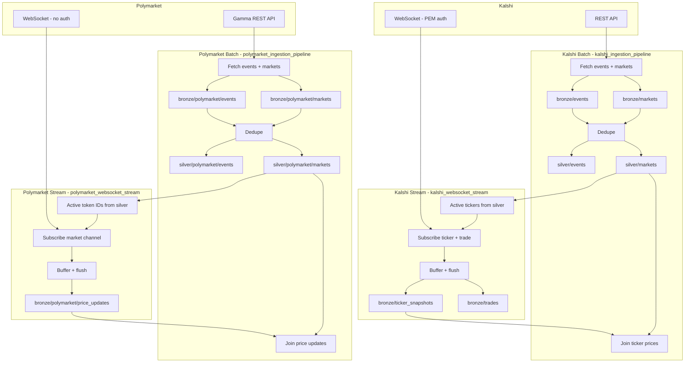

# betywety

Prediction-market data pipelines — Kalshi and Polymarket. Bronze/silver medallion architecture with REST ingestion and WebSocket streaming.

## Data Flow



### Order of operations

1. Run ingestion pipeline first (REST fetch, bronze, silver dedupe)
2. Run WebSocket stream (subscribes to active markets from silver, appends to bronze)
3. Re-run ingestion (or price-update cells) to refresh silver with latest stream data

### Systems and responsibilities

| System | Responsibility |
|--------|----------------|
| **Kalshi REST API** | Events and markets snapshots (public, no auth). Called by `kalshi_ingestion_pipeline`. |
| **Kalshi WebSocket** | Real-time ticker and trade data. PEM auth required. Consumed by `kalshi_websocket_stream`. |
| **Polymarket Gamma API** | Events and markets snapshots (public, no auth). Called by `polymarket_ingestion_pipeline`. |
| **Polymarket CLOB WebSocket** | Real-time price changes, best bid/ask, last trade. No auth for market channel. Consumed by `polymarket_websocket_stream`. |
| **Databricks (kalshi_ingestion_pipeline)** | Fetches Kalshi events/markets via REST, writes bronze, dedupes to silver, joins ticker stream for price enrichment. Hourly schedule. |
| **Databricks (kalshi_websocket_stream)** | Reads active tickers from silver, connects WebSocket, buffers ticker/trade messages, appends to bronze. Runs continuously. |
| **Databricks (polymarket_ingestion_pipeline)** | Fetches Polymarket events/markets via Gamma API, writes bronze, dedupes to silver, joins price stream for enrichment. Hourly schedule. |
| **Databricks (polymarket_websocket_stream)** | Reads active token IDs from silver, connects CLOB WebSocket, buffers price messages, appends to bronze. Runs continuously. |
| **ADLS Gen2 (kalshi-data container)** | Stores all Delta tables: Kalshi bronze/silver and Polymarket bronze/silver (under `polymarket/` subdirs). |
| **Azure Key Vault** | Secrets: `sp-client-secret` (ADLS OAuth), `kalshi-api-key`, `kalshi-private-key` (Kalshi WebSocket auth). |
| **Databricks Secret Scope (kalshi-secrets)** | Linked to Key Vault. All notebooks read secrets via `dbutils.secrets.get()`. |
| **Service principal (sp-kalshi-databricks)** | OAuth identity for Databricks to access ADLS and Key Vault. Storage Blob Data Contributor + Key Vault Secrets User. |

## Quick Start

1. Deploy infrastructure: see [infrastructure/arm/README.md](infrastructure/arm/README.md)
2. Run `notebooks/kalshi_ingestion_pipeline.py` — Kalshi REST fetch, bronze, silver
3. Run `notebooks/kalshi_websocket_stream.py` — Kalshi ticker/trade stream to bronze
4. Run `notebooks/polymarket_ingestion_pipeline.py` — Polymarket REST fetch, bronze, silver
5. Run `notebooks/polymarket_websocket_stream.py` — Polymarket price stream to bronze

## Workflows (Databricks Asset Bundles)

Jobs are defined in `databricks.yml` and `resources/jobs.yml`.

**Deploy:**
```bash
databricks configure   # if not done
databricks bundle deploy -t dev
```

**Jobs:**
- **kalshi_ingestion** — Runs hourly. REST fetch → bronze → silver → price update.
- **kalshi_websocket_stream** — Start manually, runs until stopped. Streams ticker/trade to bronze.
- **polymarket_ingestion** — Runs hourly. REST fetch → bronze → silver → price update.
- **polymarket_websocket_stream** — Start manually, runs until stopped. Streams price updates to bronze.

**Manual run:**
```bash
databricks bundle run kalshi_ingestion -t dev
databricks bundle run kalshi_websocket_stream -t dev
databricks bundle run polymarket_ingestion -t dev
databricks bundle run polymarket_websocket_stream -t dev
```

Or trigger from the Databricks Jobs UI after deploy.
