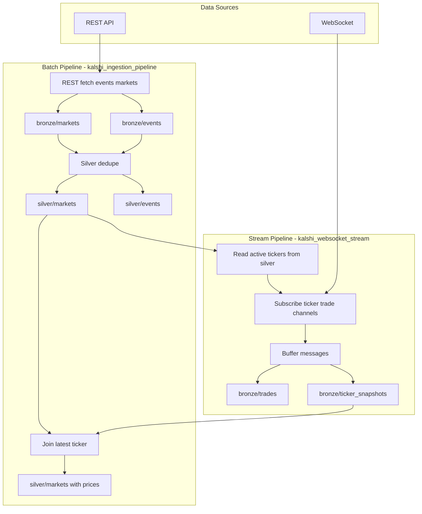

# Kalshi Pipeline

Kalshi college basketball live price pipeline — bronze/silver ingestion and WebSocket streaming.

## Data Flow



**Batch flow:** REST API → bronze (events, markets) → silver (deduped) → silver enriched with latest ticker prices.

**Stream flow:** WebSocket subscribes to active markets from silver → buffers ticker/trade messages → appends to bronze (ticker_snapshots, trades).

**Order:** Run `kalshi_ingestion_pipeline` first (bronze + silver). Then run `kalshi_websocket_stream` to stream live prices. Re-run the ingestion pipeline (or the price-update cells) to refresh silver with latest ticker data.

## Quick Start

1. Deploy infrastructure: see [infrastructure/arm/README.md](infrastructure/arm/README.md)
2. Run `notebooks/kalshi_ingestion_pipeline.py` — REST fetch, bronze, silver
3. Run `notebooks/kalshi_websocket_stream.py` — stream ticker/trade to bronze

## Workflows (Databricks Asset Bundles)

Jobs are defined in `databricks.yml` and `resources/jobs.yml`.

**Deploy:**
```bash
databricks configure   # if not done
databricks bundle deploy -t dev
```

**Jobs:**
- **kalshi_ingestion** — Runs hourly. REST fetch → bronze → silver → price update.
- **kalshi_websocket_stream** — Start manually, runs until stopped. Streams ticker/trade to bronze.

**Manual run:**
```bash
databricks bundle run kalshi_ingestion -t dev
databricks bundle run kalshi_websocket_stream -t dev
```

Or trigger from the Databricks Jobs UI after deploy.
