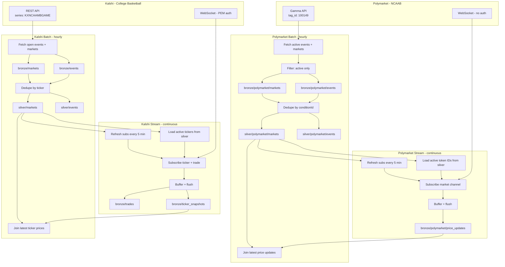

# betywety

College basketball prediction-market pipelines — Kalshi (`KXNCAAMBGAME`) and Polymarket (`tag_id=100149` NCAAB). Bronze/silver medallion architecture with REST ingestion and WebSocket streaming. Only active lines are tracked.

## Data Flow



### How it works

1. **Hourly ingestion** pulls only active CBB events/markets from each exchange's REST API into bronze, dedupes into silver
2. **Continuous streams** subscribe to active lines from silver via WebSocket, buffer messages, and append to bronze
3. **Subscription refresh** — every 5 minutes the streams re-read silver, subscribe to new markets, and unsubscribe from resolved ones (no reconnection needed)
4. **Price enrichment** — ingestion pipeline joins latest stream data back into silver for up-to-date prices

### Filtering

| Exchange | Filter | Effect |
|----------|--------|--------|
| **Kalshi** | `series_ticker=KXNCAAMBGAME`, `status=open` | Men's College Basketball games only |
| **Polymarket** | `tag_id=100149`, `active=true`, `closed=false` | NCAAB events only, closed markets excluded |
| **Streams** | Re-read silver every 5 min | Auto-subscribe new lines, drop resolved ones |

### Systems and responsibilities

| System | Responsibility |
|--------|----------------|
| **Kalshi REST API** | CBB events and markets snapshots (public, no auth). Filtered by `KXNCAAMBGAME` series. |
| **Kalshi WebSocket** | Real-time ticker and trade data for active CBB markets. PEM auth required. |
| **Polymarket Gamma API** | NCAAB events and active markets (public, no auth). Filtered by `tag_id=100149`. |
| **Polymarket CLOB WebSocket** | Real-time price changes, best bid/ask, last trade for active token IDs. No auth. |
| **Databricks (kalshi_ingestion_pipeline)** | Fetches Kalshi CBB events/markets, writes bronze, dedupes to silver, joins ticker stream for price enrichment. Hourly. |
| **Databricks (kalshi_websocket_stream)** | Subscribes to active CBB tickers from silver, buffers ticker/trade to bronze. Refreshes subs every 5 min. Continuous. |
| **Databricks (polymarket_ingestion_pipeline)** | Fetches Polymarket NCAAB events, filters active-only markets, writes bronze, dedupes to silver, joins price stream. Hourly. |
| **Databricks (polymarket_websocket_stream)** | Subscribes to active NCAAB token IDs from silver, buffers price updates to bronze. Refreshes subs every 5 min. Continuous. |
| **ADLS Gen2 (kalshi-data container)** | Stores all Delta tables: Kalshi bronze/silver and Polymarket bronze/silver (under `polymarket/` subdirs). |
| **Azure Key Vault** | Secrets: `sp-client-secret` (ADLS OAuth), `kalshi-api-key`, `kalshi-private-key` (Kalshi WebSocket auth). |
| **Databricks Secret Scope (kalshi-secrets)** | Linked to Key Vault. All notebooks read secrets via `dbutils.secrets.get()`. |
| **Service principal (sp-kalshi-databricks)** | OAuth identity for Databricks to access ADLS and Key Vault. Storage Blob Data Contributor + Key Vault Secrets User. |

## Quick Start

1. Deploy infrastructure: see [infrastructure/arm/README.md](infrastructure/arm/README.md)
2. Run `notebooks/kalshi_ingestion_pipeline.py` — Kalshi CBB REST fetch, bronze, silver
3. Run `notebooks/kalshi_websocket_stream.py` — Kalshi CBB ticker/trade stream
4. Run `notebooks/polymarket_ingestion_pipeline.py` — Polymarket NCAAB REST fetch, bronze, silver
5. Run `notebooks/polymarket_websocket_stream.py` — Polymarket NCAAB price stream

## Workflows (Databricks Asset Bundles)

Jobs are defined in `databricks.yml` and `resources/jobs.yml`.

**Deploy:**
```bash
databricks bundle deploy -t dev
```

**Jobs:**
- **kalshi_ingestion** — Hourly. REST fetch CBB → bronze → silver → price update.
- **kalshi_websocket_stream** — Manual start, runs continuously. Streams active CBB ticker/trade to bronze. Refreshes subs every 5 min.
- **polymarket_ingestion** — Hourly. REST fetch NCAAB (active only) → bronze → silver → price update.
- **polymarket_websocket_stream** — Manual start, runs continuously. Streams active NCAAB prices to bronze. Refreshes subs every 5 min.

**Manual run:**
```bash
databricks bundle run kalshi_ingestion -t dev
databricks bundle run kalshi_websocket_stream -t dev
databricks bundle run polymarket_ingestion -t dev
databricks bundle run polymarket_websocket_stream -t dev
```

Or trigger from the Databricks Jobs UI after deploy.
